# WAMP v2 Specification

This document specifies version 2 of the [WAMP](http://wamp.ws/) protocol.

## Introduction

WAMP ("Web Application Messaging Protocol") is an open application communication protocol that provides two asynchronous messaging patterns within one protocol:

 * Publish & Subscribe
 * Remote Procedure Calls

## Building Blocks

WAMP is defined with respect to the following building blocks 

   1. Serialization
   2. Transport

For each building block, WAMP only assumes a defined set of requirements, which allows to run WAMP variants with different concrete bindings.

### Serialization

WAMP is a message based protocol that requires serialization of messages to octet sequences to be sent out on the wire.

A message *serialization* format is assumed that (at least) provides the following types:

  * `integer` (non-negative)
  * `string` (UTF-8 encoded Unicode)
  * `list`
  * `dict` (with string keys)

WAMP *itself* only uses above types. The application payloads transmitted by WAMP (e.g. in call arguments or event payloads) may use other types a concrete serialization format supports.

WAMPv2 defines two bindings for message *serialization*:

 1. [JSON](http://www.json.org/)
 2. [MsgPack](http://msgpack.org/)

> * As noted above, WAMP *itself* does only use a subset of types - e.g. it does not use the JSON types `number` (non-integer), `bool` and `null`.
> * With MsgPack, the [version 5](https://github.com/msgpack/msgpack/blob/master/spec.md) MUST BE supported - which is able to differentiate between strings and binary values.
> 

Other bindings for *serialization* may be defined in future WAMP versions.

### Transport

WAMP assumes a *transport* with the following characteristics:

  1. message-based
  2. reliable
  3. ordered
  4. full-duplex

#### WebSocket Transport

The default transport binding is [WebSocket](http://tools.ietf.org/html/rfc6455). With WebSocket, WAMP messages are transmitted as WebSocket messages: each WAMP message is transmitted as a separate WebSocket message (not WebSocket frame).

The WAMP protocol MUST BE negotiated during the WebSocket opening handshake between peers using the WebSocket subprotocol negotiation mechanism.

WAMPv2 uses the following WebSocket subprotocol identifiers:

 * `wamp.2.json`
 * `wamp.2.msgpack`

With `wamp.2.json`, *all* WebSocket messages MUST BE of type **text** (UTF8 encoded payload) and use the JSON message serialization.

With `wamp.2.msgpack`, *all* WebSocket messages MUST BE of type **binary** and use the MsgPack message serialization.

#### Other Transports

Besides the WebSocket transport, the following WAMP transports are under development:

 * HTTP 1.0/1.1 long-polling

Other transports such as HTTP 2.0 ("SPDY"), raw TCP or UDP might be defined in the future.

## Peer Roles

A transport connects two WAMP peers and provides a channel over which WAMP messages for a *single* WAMP session can flow in both directions.

A WAMP peer can have one or more of the following roles.

**RPC**

1. Callee
2. Caller
3. Dealer

*Callees* register procedures they provide with *Dealers*.

*Callers* initiate procedure calls first to *Dealers*.

*Dealers* route calls incoming from *Callers* to *Callees* implementing the procedure called.

**PubSub**

1. Subscriber
2. Publisher
3. Broker

*Subscribers* subscribe to topics they are interested in with *Brokers*.

*Publishers* publish events to topics at *Brokers*.

*Brokers* route events incoming from *Publishers* to *Subscribers* subscribed to the topic published to.

### Decoupling

*Dealers* are responsible for call routing decoupling *Callers* from *Callees*, whereas *Brokers* are responsible for event routing decoupling *Publishers* from *Subscribers*.

### Symmetry

It's important to note that though the establishment of a transport connection might have a inherent asymmetry (like a *client* establishes a TCP and WebSocket connection to a *server*), WAMP itself is designed to be fully symmetric. After the transport has been established, both peers are equal in principle.

### Peers with multiple Roles

Peers might implement more than one role: e.g. a peer might act as *Caller*, *Publisher* and *Subscriber* at the same time. Another peer might act as both a *Broker* and a *Dealer*. And a *Dealer* might also act as a *Callee*. With the latter, a peer might "route" an incoming call directly to an implementing endpoint within the same program (and hence no actual messaging over a transport is happening).

## URIs

WAMP needs to identify *persistent* resources like:

  * Topics
  * Procedures
  * Errors

These are identified in WAMP using *Uniform Resource Identifiers* (URIs) that MUST BE UTF-8 encoded Unicode strings.

*Examples*

	com.myapp.mytopic1
	com.myapp.myprocedure1
	com.myapp.mymodule.somerror

The URIs are understood to form a global, hierarchical namespace for WAMP. To avoid resource naming conflicts, we follow the package naming convention from Java where URIs SHOULD begin with (reversed) domain names owned by the organization defining the URI.

URI components (the parts between between `.`) MUST NOT contain `.` and MUST NOT be empty (zero-length strings).

> We cannot allow `.` in component strings, since `.` is used to separate components, and WAMP associates semantics with resource hierarchies such as in pattern-based subscriptions. We cannot allow empty (zero-length) strings as components, since this has special meaning to denote wildcard components with pattern-based subscriptions.
> 

URI components SHOULD match the regular expression `[a-z][a-z0-9_]*` (that is start with a letter, followed by zero or more letters, digits or `_`).

> Following the suggested regular expression will make URI components valid identifiers in most languages (modulo language keywords) and the use of lower-case only will make those identifiers unique in languages that have case-insensitive identifiers. Following this suggestion can allow implementations to map topics, procedures and errors to the language enviroment in a completely transparent way. 

Further, application URIs MUST NOT use `wamp` as a first URI component, since this is reserved for URIs predefined with the WAMP protocol itself.

## IDs

WAMP needs to identify *ephemeral* "things" like:

 * Requests
 * Subscriptions
 * Registrations

These are identified in WAMP using IDs that are (positive) integers between (inclusive) `0` and `2^53` (`9007199254740992L`) and which MUST BE drawn *randomly* from a *uniform distribution* over the specified range.

> The reason to choose the specific upper bound is that `2^53` is the largest integer such that this integer and *all* (positive) smaller integers can be represented exactly in IEEE-754 doubles. Some languages (e.g. JavaScript) use doubles as their sole number type. Most languages do have signed and unsigned 64-bit integer types which both can hold any value from the specified range. 
> 

## Messages

### Overview

All WAMP messages are of the same structure - a `list` with a first element `MessageType` followed by zero or more message type specific elements:

    [MessageType|integer, ... zero or more message type specific elements ...]

The notation `Element|type` denotes a message element named `Element` of type `type`, where `type` is one of:

 * `integer`: a non-negative integer
 * `string`: any UTF-8 encoded Unicode string, including the empty string
 * `id`: an integer ID as defined above
 * `uri`: a string URI as defined above
 * `dict`: a dictionary (map)
 * `list`: a list (array)
 * `any`: any scalar or complex type the serialization supports

> Keys with above `dicts` MUST BE of type `string` and SHOULD match the regular expression `[a-z][a-z0-9_]*`
> 

WAMP defines the following messages which are explained in detail in the further sections.

### Session Management

#### Any-to-Any

    [HELLO,        			Session|id, Details|dict]
    [GOODBYE,      			Details|dict]
    [HEARTBEAT,    			IncomingSeq|integer, OutgoingSeq|integer, Discard|string]

### Publish & Subscribe

#### Publisher-to-Broker

    [PUBLISH,      			Request|id, Options|dict, Topic|uri, Event|any]

#### Broker-to-Publisher

    [PUBLISHED,  			PUBLISH.Request|id, Publication|id]
    [PUBLISH_ERROR, 		PUBLISH.Request|id, Error|uri]

#### Subscriber-to-Broker

    [SUBSCRIBE,    			Request|id, Options|dict, Topic|uri]
    [UNSUBSCRIBE,  			Request|id, SUBSCRIBED.Subscription|id]

#### Broker-to-Subscriber

    [SUBSCRIBED,   			SUBSCRIBE.Request|id, Subscription|id]
    [SUBSCRIBE_ERROR, 		SUBSCRIBE.Request|id, Error|uri]
    [UNSUBSCRIBED, 			UNSUBSCRIBE.Request|id]
    [UNSUBSCRIBE_ERROR, 	UNSUBSCRIBE.Request|id, Error|uri]
    [EVENT,        			SUBSCRIBED.Subscription|id, PUBLISHED.Publication|id, Details|dict,
								PUBLISH.Topic|uri, PUBLISH.Event|any]
    [METAEVENT,    			SUBSCRIBED.Subscription|id, Publication|id, MetaTopic|uri, MetaEvent|any]

### Remote Procedure Calls

#### Caller-to-Dealer

    [CALL,         			Request|id, Options|dict, Procedure|uri, Arguments|list, ArgumentsKw|dict]
    [CANCEL_CALL,  			CALL.Request|id, Options|dict]
    
#### Dealer-to-Caller

    [CALL_PROGRESS, 		CALL.Request|id, INVOCATION_PROGRESS.Progress|list, INVOCATION_PROGRESS.ProgressKw|dict]
    [CALL_RESULT,   		CALL.Request|id, INVOCATION_RESULT.Result|list, INVOCATION_RESULT.ResultKw|dict]
    [CALL_ERROR,    		CALL.Request|id, INVOCATION_ERROR.Error|uri, INVOCATION_ERROR.Exception|any]

#### Callee-to-Dealer

    [REGISTER,     			Request|id, Options|dict, Procedure|uri]
    [UNREGISTER,    		Request|id, REGISTERED.Registration|id]
    [INVOCATION_PROGRESS, 	INVOCATION.Request|id, Progress|list, ProgressKw|dict]
    [INVOCATION_RESULT,   	INVOCATION.Request|id, Result|list, ResultKw|dict]
    [INVOCATION_ERROR,    	INVOCATION.Request|id, Error|uri, Exception|any]

#### Dealer-to-Callee

	[REGISTERED,     		REGISTER.Request|id, Registration|id]
    [REGISTER_ERROR, 		REGISTER.Request|id, Error|uri]
    [UNREGISTERED,   		UNREGISTER.Request|id]
    [UNREGISTER_ERROR, 		UNREGISTER.Request|id, Error|uri]
    [INVOCATION,   			Request|id, REGISTERED.Registration|id, Options|dict,
								CALL.Arguments|list, CALL.ArgumentsKw|dict]
    [CANCEL_INVOCATION,		INVOCATION.Request|id, Options|dict]

## Message Type Codes

	HELLO					:=  1
	GOODBYE					:=  2
	HEARTBEAT				:=  3

	SUBSCRIBE				:= 10
	SUBSCRIBED				:= 11
	SUBSCRIBE_ERROR			:= 12
	
	UNSUBSCRIBE				:= 20
	UNSUBSCRIBED			:= 21
	UNSUBSCRIBE_ERROR		:= 22
	
	PUBLISH					:= 30
	PUBLISHED				:= 31
	PUBLISH_ERROR			:= 32

	EVENT					:= 40
	METAEVENT				:= 41
	
	REGISTER				:= 50
	REGISTERED				:= 51
	REGISTER_ERROR			:= 52

	UNREGISTER				:= 60
	UNREGISTERED			:= 61
	UNREGISTER_ERROR		:= 62

	CALL					:= 70
	CANCEL_CALL				:= 71
	CALL_PROGRESS			:= 72
	CALL_RESULT				:= 73
	CALL_ERROR				:= 74

	INVOCATION				:= 80
	CANCEL_INVOCATION		:= 81
	INVOCATION_PROGRESS		:= 82
	INVOCATION_RESULT		:= 83
	INVOCATION_ERROR		:= 84

## Session Management

### Hello and Goodbye

When a WAMP session starts, the peers introduce themselves to each other by sending a `HELLO` message:

    [HELLO, Session|id, Details|dict]

 * `Session` MUST BE a randomly generated ID specific to the WAMP session for each direction. Each peer tells it connected peer the `Session` ID under which it is identified (for the lifetime of the WAMP session). 
 * `Details` is a dictionary that allows to provide additional opening information (see below).

The `HELLO` message MUST be the very first message sent by each of the two peers after the transport has been established and a peer MUST wait for the `HELLO` message to be received from the other peer before performing anything else. It is a protocol error to receive a second `HELLO` message during the lifetime of the session and the peer MUST fail the session if that happens.

The `HELLO.Session` can (later) be used for:

 * specifying lists of excluded or eligible receivers when publishing events
 * in the context of performing authentication or authorization 

*Example*

    [1, 9129137332, {... see below ...}]

A WAMP peer MUST announce the roles it supports via `Hello.Details.roles|dict`, with a key mapping to a `Hello.Details.roles.<role>|dict` where `<role>` can be:

 * `publisher`
 * `subscriber`
 * `broker`
 * `caller`
 * `callee`
 * `dealer`

A peer can support any combination of above roles but MUST support at least one role.

Further *Publisher* and *Subscriber* peers can only talk to *Broker* peers, and *Caller* and *Callee* peers can only talk to *Dealer* peers.

A *Publisher* peer cannot talk to another peer that only implements e.g. a *Callee* role.  

*Example: A peer that can act as Publisher and Subscriber, but only supports basic features.*

	[1, 9129137332, {
		"roles": {
			"publisher": {},
			"subscriber": {}
		}
	}]

*Example: A peer that can act as a Broker and supports a couple of optional features.*

	[1, 9129137332, {
		"roles": {
			"broker": {
				"exclude": 1,
			 	"eligible": 1,
			 	"exclude_me": 1,
			 	"disclose_me": 1
			}
     	}
	}]

Similar to what browsers do with the `User-Agent` HTTP header, the `HELLO` message MAY disclose the WAMP implementation in use to it's peer:

    HELLO.Details.agent|string

*Example*

    [1, 9129137332, {"agent": "AutobahnPython-0.7.0"}]

A WAMP session starts it's lifetime when both peers have received `HELLO` from the other, and ends when the underlying transport closes or when the session is closed explicitly by sending the `GOODBYE` message

    [GOODBYE, Details|dict]

 * `Details` is a dictionary that allows to provide additional closing information (see below).

*Example*

	[2, {}]

A peer MAY provide additional details of the reason of closing and a message (intended for logging or debugging purposes):

    GOODBYE.Details.reason|uri
    GOODBYE.Details.message|string

*Example*

    [2, {"reason": "wamp.error.system_shutdown", "message": "The host is shutting down now."}]

*Example*

    [2, {"reason": "wamp.error.protocol_violation", "message": "Invalid type for 'topic' in SUBSCRIBE."}]

### Heartbeats

The heartbeat allows to keep network intermediaries from closing the underlying transport, notify the peer up to which incoming heartbeat all incoming WAMP messages have been processed, and announce an outgoing hearbeat sequence number in the same message.

A peer MAY send a `HEARTBEAT` message at any time:

    [HEARTBEAT, IncomingSeq|integer, OutgoingSeq|integer, Discard|string]

 * `HEARTBEAT.OutgoingSeq` MUST start with `1` and be incremented by `1` for each `HEARTBEAT` a peer sends.
 * `HEARTBEAT.IncomingSeq` MUST BE the sequence number from the last received heartbeat for which all previously received WAMP messages have been processed or `0` when no `HEARTBEAT` has still been received
 *  `HEARTBEAT.Discard` is an arbitrary string discarded by the peer.

> The `HEARTBEAT.Discard` can be used to exhibit some traffic volume e.g. to keep mobile radio channels in a low-latency, high-power state. The string SHOULD be a random string (otherwise compressing transports might compress away the traffic volume).
> 

*Example*

	[3, 0, 1, ""]

*Example*

	[3, 23, 5, ""]

*Example*

	[3, 23, 5, "throw me away ... I am just noise"]

Incoming heartbeats are not required to be answered by an outgoing heartbeat, but sending of hearbeats is under independent control with each peer.

## Publish & Subscribe

### Subscribing and Unsubscribing

The message flow between *Subscribers* and a *Broker* for subscribing and unsubscribing involves the following messages:

 1. `SUBSCRIBE`
 2. `SUBSCRIBED`
 3. `SUBSCRIBE_ERROR`
 4. `UNSUBSCRIBE`
 5. `UNSUBSCRIBED`
 6. `UNSUBSCRIBE_ERROR`

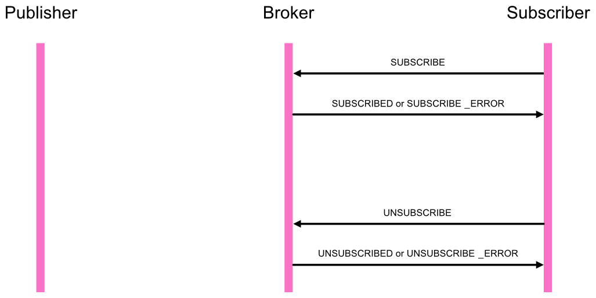

A *Subscriber* communicates it's interest in a topic to a *Broker* by sending a `SUBSCRIBE` message:

    [SUBSCRIBE, Request|id, Options|dict, Topic|uri]

 * `Request` is a random, ephemeral ID chosen by the *Subscriber* and used to correlate the *Broker's* response with the request.
 * `Options` is a dictionary that allows to provide additional subscription request details in a extensible way. This is described further below.
 * `Topic` is the topic the *Subscriber* wants to subscribe to.

*Example*

	[10, 713845233, {}, "com.myapp.mytopic1"]

If the *Broker* is able to fulfil and allowing the subscription, it answers by sending a `SUBSCRIBED` message to the *Subscriber*

    [SUBSCRIBED, SUBSCRIBE.Request|id, Subscription|id]

 * `SUBSCRIBE.Request` is the ID from the original request.
 * `Subscription` is an ID chosen by the *Broker* for the subscription.

*Example*

	[11, 713845233, 5512315355]

> Note. The `Subscription` ID chosen by the broker may be unique only for the `Topic` (and possibly other information from `Options`, such as the topic pattern matching method to be used). The ID might be the same for any *Subscriber* for the same `Topic`. This allows the *Broker* to serialize an event to be delivered only once for all actual receivers of the event.
> 

When the request for subscription cannot be fulfilled by the *Broker*, the *Broker* sends back a `SUBSCRIBE_ERROR` message to the *Subscriber*

    [SUBSCRIBE_ERROR, SUBSCRIBE.Request|id, Error|uri]

 * `SUBSCRIBE.Request` is the ID from the original request.
 * `Error` is an URI that gives the error of why the request could not be fulfilled.

*Example*

	[12, 713845233, "wamp.error.not_authorized"]

When a *Subscriber* is no longer interested in receiving events for a subscription it sends an `UNSUBSCRIBE` message

    [UNSUBSCRIBE, Request|id, SUBSCRIBED.Subscription|id]

 * `Request` is a random, ephemeral ID chosen by the *Subscriber* and used to correlate the *Broker's* response with the request.
 * `SUBSCRIBED.Subscription` is the ID for the subscription to unsubcribe from, originally handed out by the *Broker* to the *Subscriber*.

*Example*

	[20, 85346237, 5512315355]

Upon successful unsubscription, the *Broker* sends an `UNSUBSCRIBED` message to the *Subscriber*

    [UNSUBSCRIBED, UNSUBSCRIBE.Request|id]

 * `UNSUBSCRIBE.Request` is the ID from the original request.

*Example*

	[21, 85346237]

When the request failed, the *Broker* sends an `UNSUBSCRIBE_ERROR`

    [UNSUBSCRIBE_ERROR, UNSUBSCRIBE.Request|id, Error|uri]

 * `UNSUBSCRIBE.Request` is the ID from the original request.
 * `Error` is an URI that gives the error of why the request could not be fulfilled.

*Example*

	[22, 85346237, "wamp.error.no_such_subscription"]
 

### Publishing

The message flow between *Publishers*, a *Broker* and *Subscribers* for publishing and dispatching events involves the following messages:

 1. `PUBLISH`
 2. `PUBLISHED`
 3. `PUBLISH_ERROR`
 4. `EVENT`

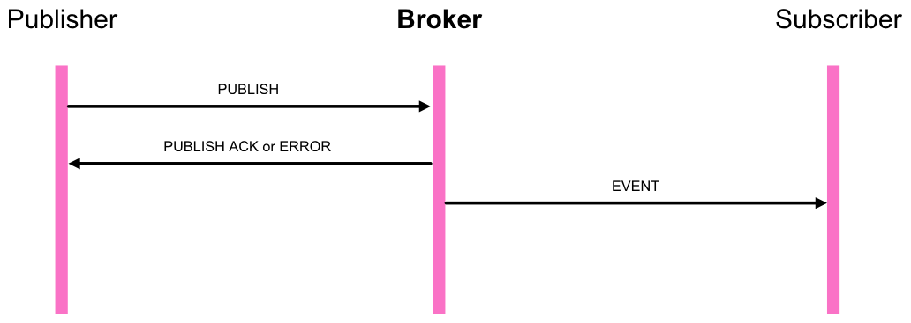

When a *Publisher* wishes to publish an event to some topic, it sends a `PUBLISH` message to a *Broker*:

    [PUBLISH, Request|id, Options|dict, Topic|uri, Event|any]

 * `Request` is a random, ephemeral ID chosen by the *Publisher* and used to correlate the *Broker's* response with the request.
 * `Options` is a dictionary that allows to provide additional publication request details in an extensible way. This is described further below.
 * `Event` is an arbitrary application-level event payload.

*Example*

    [30, 239714735, {}, "com.myapp.mytopic1", "Hello, world!"]

*Example*

    [30, 239714735, {}, "com.myapp.mytopic1", {"color": "orange", "sizes": [23, 42, 7]}]

*Example*

    [30, 239714735, {}, "com.myapp.mytopic1", null]

If the *Broker* is able to fulfill and allowing the publication, it answers by sending a `PUBLISHED` message to the *Publisher*:

    [PUBLISHED, PUBLISH.Request|id, Publication|id]

 * `PUBLISH.Request` is the ID from the original publication request.
 * `Publication` is a ID chosen by the Broker for the publication.

*Example*

    [31, 239714735, 4429313566]

When the request for publication cannot be fulfilled by the *Broker*, the *Broker* sends back a `PUBLISH_ERROR` message to the *Publisher*

    [PUBLISH_ERROR, PUBLISH.Request|id, Error|uri]

 * `PUBLISH.Request` is the ID from the original publication request.
 * `Error` is an URI that gives the error of why the request could not be fulfilled.

*Example*

    [32, 239714735, "wamp.error.not_authorized"]

When a publication is successful and a *Broker* dispatches the event, it will determine a list of actual receivers for the event based on subscribers for the topic published to and possibly other information in the event (such as exclude and eligible receivers).

When a *Subscriber* was deemed to be an actual receiver, the *Broker* will send the *Subscriber* an `EVENT` message:

    [EVENT, SUBSCRIBED.Subscription|id, PUBLISHED.Publication|id, Details|dict, PUBLISH.Topic|uri, PUBLISH.Event|any]

 * `SUBSCRIBED.Subscription` is the ID for the subscription under which the *Subscriber* receives the event - the ID for the subscription originally handed out by the *Broker* to the *Subscriber*.
 * `PUBLISHED.Publication` is the ID of the publication of the published event.
 * `Details` is a dictionary that allows the *Broker* to provide additional event details in a extensible way. This is described further below.
 * `PUBLISH.Topic` is the original topic under which the *Publisher* published the event. And `PUBLISH.Event` is the application-level payload the event has been published with.
 * `PUBLISH.Event` is the application-level event payload that was provided with the original publication request.

*Example*

	[40, 5512315355, 4429313566, {}, "com.myapp.mytopic1", "Hello, world!"]

*Example*

	[40, 5512315355, 4429313566, {}, "com.myapp.mytopic1", {"color": "orange", "sizes": [23, 42, 7]}]

*Example*

	[40, 5512315355, 4429313566, {}, "com.myapp.mytopic1", null]

### Publisher Exclusion

By default, a *Publisher* of an event will not receive an event published itself, even when (also) subscribed to the `Topic` the *Publisher* is publishing to. This behavior can be overridden via `PUBLISH.Options.excludeme`.

*Example*

    [30, 239714735, {"exclude_me": 0}, "com.myapp.mytopic1", "Hello, world!"]

### Exclude and Eligible

A *Publisher* MAY restrict the receivers of an event beyond those subscribed via `PUBLISH.Options.exclude|list` and `PUBLISH.Options.eligible|list`.

`PUBLISH.Options.exclude` is a list of WAMP session IDs providing an explicit list of (potential) *Subscribers* that won't receive a published event, even though they might be subscribed. In other words, a blacklist of (potential) *Subscribers*.

`PUBLISH.Options.eligible` is a list of WAMP session IDs providing an explicit list of (potential) *Subscribers* that are allowed to receive a published event. In other words, a blacklist of (potential) *Subscribers*.

The *Broker* will dispatch events published only to *Subscribers* that are not explicitly excluded and are explicitly eligible.

*Example*

    [30, 239714735,
		{"exclude": [7891255, 1245751]},
		"com.myapp.mytopic1", "Hello, world!"]
 
*Example*

    [30, 239714735,
		{"eligible": [7891255, 1245751]},
		"com.myapp.mytopic1", "Hello, world!"]

*Example*

    [30, 239714735,
		{"exclude": [7891255], "eligible": [7891255, 1245751, 9912315]},
		"com.myapp.mytopic1", "Hello, world!"]

### Publisher Identification

A *Publisher* MAY request the disclosure of it's identity (it's WAMP session ID) to receivers of a published event via `PUBLISH.Options.disclose_me|int`:

*Example*

    [30, 239714735, {"disclose_me": 1}, "com.myapp.mytopic1", "Hello, world!"]

If above event would have been published by a *Publisher* with WAMP session ID `3335656`, the *Broker* would send an `EVENT` message to *Subscribers* with the *Publisher's* WAMP session ID in `Details.publisher`. 

*Example*

	[40, 5512315355, 4429313566, {"publisher": 3335656}, "com.myapp.mytopic1", "Hello, world!"]

Note that a *Broker* MAY disclose the identity of a *Publisher* even without the *Publisher* having explicitly requested to do so when the *Broker* configuration (for the publication topic) is setup to do so.

A *Broker* MAY deny a *Publisher's* request to disclose it's identity

*Example*

    [32, 239714735, "wamp.error.disclose_me.not_allowed"]

### Trust Level

A *Broker* may be configured to automatically assign *trust levels* to events published by *Publishers* according to the *Broker* configuration on a per-topic basis and/or depending on the application defined role of the (authenticated) *Publisher*.

A *Broker* must use `Details.trustlevel|integer` in an `EVENT` message sent to a *Subscriber*. The trustlevel `0` means lowest trust, and higher integers represent (application-defined) higher levels of trust.

*Example*

	[40, 5512315355, 4429313566, {"trustlevel": 2}, "com.myapp.mytopic1", "Hello, world!"]

### Pattern-based Subscriptions

*Example*

	[10, 912873614, "com.myapp.topic.emergency", {"match": "prefix"}]

*Example*

	[10, 912873614, "com.myapp..userevent", {"match": "wildcard"}]

### Meta Events

*Example*

	[10, 713845233,
         {"metatopics": ["wamp.metatopic.subscriber.joined",
                         "wamp.metatopic.subscriber.left"]},
         "com.myapp.mytopic1"]

Metaevents are always generated by the *Broker* itself:

    [METAEVENT, SUBSCRIBED.Subscription|id, Publication|id, MetaTopic|uri, MetaEvent|any]

*Example*

	[41, 5512315355, 71415664, "wamp.metatopic.subscriber.joined", 71254637]

*Example*

	[41, 5512315355, 35262477, "wamp.metatopic.subscriber.left", 71254637]

Getting initial (current) list of subscribers

	[10, 713845233,
         {"metatopics": ["wamp.metatopic.subscriber.current",
                         "wamp.metatopic.subscriber.joined",
                         "wamp.metatopic.subscriber.left"]},
         "com.myapp.mytopic1"]

## Remote Procedure Calls

### Registering and Unregistering

The message flow between *Callees* and a *Dealer* for registering and unregistering endpoints to be called over RPC involves the following messages:

 1. `REGISTER`
 2. `REGISTERED`
 3. `REGISTER_ERROR`
 4. `UNREGISTER`
 5. `UNREGISTERED`
 6. `UNREGISTER_ERROR`

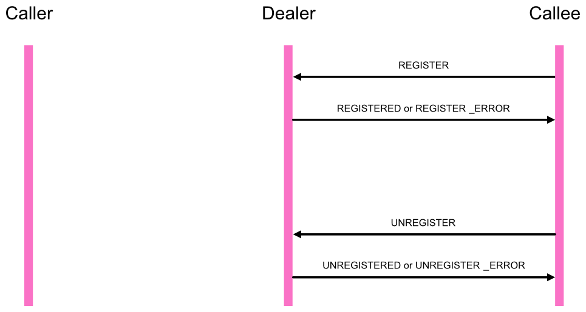

A *Callee* announces the availability of an endpoint implementing a procedure with a *Dealer* by sending a `REGISTER` message:

    [REGISTER, Request|id, Options|dict, Procedure|uri]

 * `Request` is a random, ephemeral ID chosen by the *Callee* and used to correlate the *Dealer's* response with the request.
 * `Options` is a dictionary that allows to provide additional registration request details in a extensible way. This is described further below.
 * `Procedure`is the procedure the *Callee* wants to register

*Example*

	[50, 25349185, {}, "com.myapp.myprocedure1"]

If the *Dealer* is able to fulfill and allowing the registration, it answers by sending a `REGISTERED` message to the `Callee`:

	[REGISTERED, REGISTER.Request|id, Registration|id]

 * `REGISTER.Request` is the ID from the original request.
 *  `Registration` is an ID chosen by the *Dealer* for the registration.

*Example*

	[51, 25349185, 2103333224]

When the request for registration cannot be fullfilled by the *Dealer*, the *Dealer* send back a `REGISTER_ERROR` message to the *Callee*:

    [REGISTER_ERROR, REGISTER.Request|id, Error|uri]

 * `REGISTER.Request` is the ID from the original request.
 * `Error` is an URI that gives the error of why the request could not be fulfilled.

*Example*

	[52, 25349185, "wamp.error.procedure_already_exists"]

When a *Callee* is no longer willing to provide an implementation of the registered procedure, it send an `UNREGISTER` message to the *Dealer*:

    [UNREGISTER, Request|id, REGISTERED.Registration|id]

 * `Request` is a random, ephemeral ID chosen by the *Callee* and used to correlate the *Dealer's* response with the request.
 * `REGISTERED.Registration` is the ID for the registration to revoke, originally handed out by the *Dealer* to the *Callee*.

*Example*

	[60, 788923562, 2103333224]

Upon successful unregistration, the *Dealer* send an `UNREGISTERED` message to the *Callee*:

    [UNREGISTERED, UNREGISTER.Request|id]

 * `UNREGISTER.Request` is the ID from the original request.

*Example*

	[61, 788923562]

When the unregistration request failed, the *Dealer* send an `UNREGISTER_ERROR` message:

    [UNREGISTER_ERROR, UNREGISTER.Request|id, Error|uri]

 * `UNREGISTER.Request` is the ID from the original request.
 * `Error` is an URI that gives the error of why the request could not be fulfilled.

*Example*

	[62, 788923562, "wamp.error.no_such_registration"]

## Calling

The message flow between *Callers*, a *Dealer* and *Callees* for calling remote procedures involves the following messages:

 1. `CALL`
 1. `INVOCATION`
 1. `INVOCATION_RESULT`
 1. `INVOCATION_ERROR`
 1. `CALL_RESULT`
 1. `CALL_ERROR`

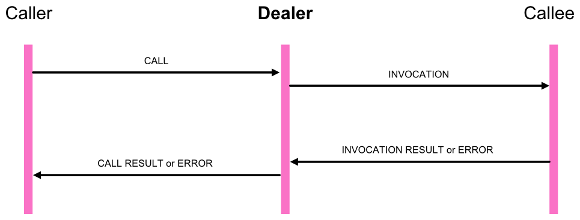

When a *Callee* wishes to call a remote procedure, it sends a `CALL` message to a *Dealer*:

    [CALL, Request|id, Options|dict, Procedure|uri, Arguments|list, ArgumentsKw|dict]

 * `Request` is a random, ephemeral ID chosen by the *Callee* and used to correlate the *Dealer's* response with the request.
 * `Options` is a dictionary that allows to provide additional call request details in an extensible way. This is described further below.
 * `Procedure` the URI of the procedure to be called.
 * `Arguments` is a list of positional call arguments (each of arbitrary type). The list may be of zero length.
 * `ArgumentsKw` is a dictionary of keyword call arguments (each of arbitrary type). The dictionary may be empty.

*Example*

	[70, 7814135, {}, "com.myapp.echo", ["Hello, world!"], {}]

*Example*

	[70, 7814135, {}, "com.myapp.add2", [23, 7], {}]

*Example*

	[70, 7814135, {}, "com.myapp.ping", [], {}]

*Example*

	[70, 7814135, {}, "com.myapp.user.new", ["johnny"], {"forname": "John", "surname": "Doe"}]

If the *Dealer* is able to fullfill (mediate) and allowing the call, it sends a `INVOCATION` message to the respective *Callee* implementing the procedure:

    [INVOCATION, Request|id, REGISTERED.Registration|id, Options|dict, CALL.Arguments|list, CALL.ArgumentsKw|dict]

 * `Request` is a random, ephemeral ID chosen by the *Dealer* and used to correlate the *Callee's* response with the request.
 * `REGISTERED.Registration` is the registration ID under which the procedure was registered at the *Dealer*.
 * `Options` is a dictionary that allows to provide additional invocation request details in an extensible way. This is described further below.
 * `CALL.Arguments` is the original list of positional call arguments as provided by the *Caller*.
 * `CALL.ArgumentsKw` is the original dictionary of keyword call arguments as provided by the *Caller*.

*Example*

	[80, 6131533, 9823526, {}, ["Hello, world!"], {}]

If the *Callee* is able to successfully process and finish the execution of the call, it answers by sending a `INVOCATION_RESULT` message to the *Dealer*:

    [INVOCATION_RESULT, INVOCATION.Request|id, Result|list, ResultKw|dict]

 * `INVOCATION.Request` is the ID from the original invocation request.
 * `Result` is a list of positional result elements (each of arbitrary type). The list may be of zero length.
 * `ResultKw` is a dictionary of keyword result elements (each of arbitrary type). The dictionary may be empty.

The *Dealer* will then send a `CALL_RESULT` message to the original *Caller*:

    [CALL_RESULT, CALL.Request|id, INVOCATION_RESULT.Result|list, INVOCATION_RESULT.ResultKw|dict]

 * `CALL.Request` is the ID from the original call request.
 * `INVOCATION_RESULT.Result` is the original list of positional result elements as returned by the *Callee*.
 * `INVOCATION_RESULT.ResultKw` is the original dictionary of keyword result elements as returned by the *Callee*.

If the *Callee* is unable to process or finish the execution of the call, or the application code implementing the procedure raises an exception or otherwise runs into an error, the *Callee* sends an `INVOCATION_ERROR` message to the *Dealer*:

    [INVOCATION_ERROR, INVOCATION.Request|id, Error|uri, Exception|any]

 * `INVOCATION.Request` is the ID from the original call request.
 * `Error` is an URI that gives the error of why the request could not be fulfilled.
 * `Exception` is an arbitrary application-defined error payload (possible empty, that is `null`).

The *Dealer* will then send a `CALL_ERROR` message to the original *Caller*:

    [CALL_ERROR, CALL.Request|id, INVOCATION_ERROR.Error|uri, INVOCATION_ERROR.Exception|any]

 * `CALL.Request` is the ID from the original call request.
 * `INVOCATION_ERROR.Error` is the original error URI as returned by the *Callee* to the *Dealer*.
 * `INVOCATION_ERROR.Exception` is the original error payload as returned by the *Callee* to the *Dealer*.

If the original call already failed at the *Dealer* **before** the call would have been forwarded to any *Callee*, the *Dealer* also (and immediately) sends a `CALL_ERROR` message to the *Caller*:

    [CALL_ERROR, CALL.Request|id, Error|uri, Exception|null]

*Example*

	[74, 7814135, "wamp.error.no_such_procedure", null]

## Progressive Call Results

A procedure implemented by a *Callee* and registered at a *Dealer* may produce progressive results (incrementally). The message flow for progressive results involves:

 * `INVOCATION_PROGRESS`
 * `CALL_PROGRESS`

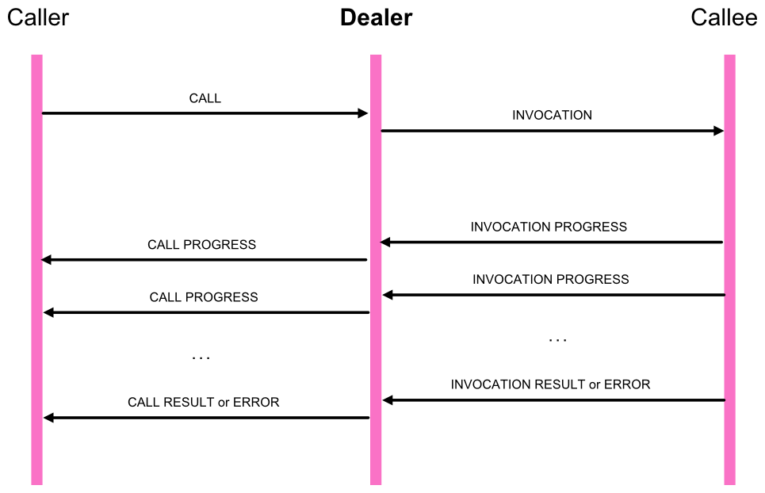

An implementing procedure produces progressive results by sending `INVOCATION_PROGRESS` messages to the *Dealer*

    [INVOCATION_PROGRESS, INVOCATION.Request|id, Progress|list, ProgressKw|dict]

Upon receiving an `INVOCATION_PROGRESS` message from a *Callee* (for a call that is still ongoing), the *Dealer* will immediately send a `CALL_PROGRESS` message to the original *Caller*:

    [CALL_PROGRESS, CALL.Request|id, INVOCATION_PROGRESS.Progress|list, INVOCATION_PROGRESS.ProgressKw|dict]

Nevertheless, a call will *always* end in either a `CALL_RESULT` or `CALL_ERROR` message being sent by the *Dealer* and received by the *Caller* and an invocation will *always* end in either a `INVOCATION_RESULT` or `INVOCATION_ERROR` message being sent by the *Callee* and received by the *Dealer*.

In other words: `CALL_PROGRESS` and `INVOCATION_PROGRESS` messages may only be sent *during* a call or invocation is still on the fly.

## Canceling Calls

The message flow between *Callers*, a *Dealer* and *Callees* for canceling remote procedure calls involves the following messages:

 * `CANCEL_CALL`
 * `CANCEL_INVOCATION`

A call may be cancelled at the *Dealer*

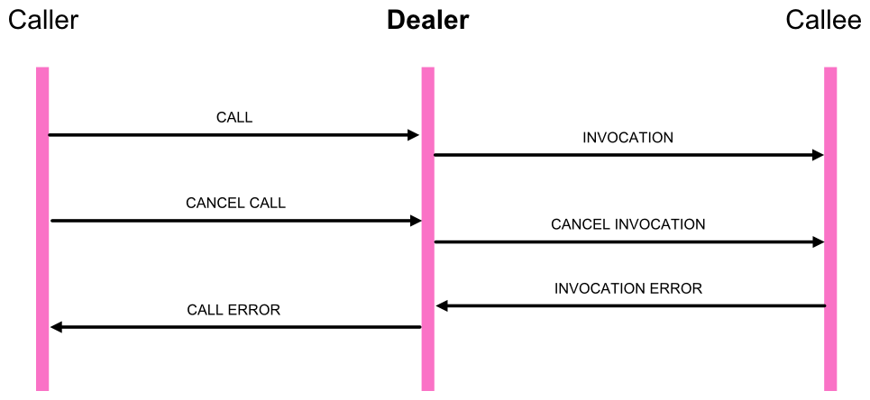

A call may be cancelled at the *Callee*

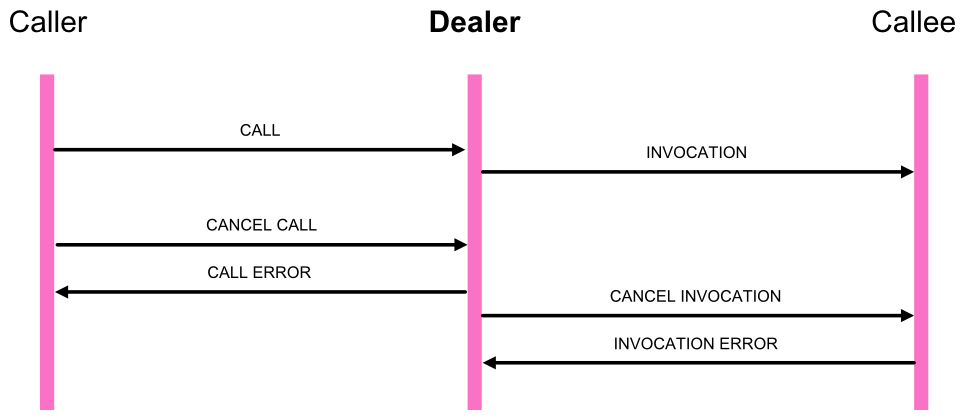

A *Callee* cancels an remote procedure call initiated (but not yet finished) by sending a `CANCEL_CALL` message to the *Dealer*:

    [CANCEL_CALL, CALL.Request|id, Options|dict]

A *Dealer* cancels an invocation of an endpoint initiated (but not yet finished) by sending a `CANCEL_INVOCATION` message to the *Callee*:

    [CANCEL_INVOCATION,		INVOCATION.Request|id, Options|dict]

## References

1. [Uniform Resource Identifier (URI): Generic Syntax, RFC 3986](http://tools.ietf.org/html/rfc3986)
2. [UTF-8, a transformation format of ISO 10646](http://tools.ietf.org/html/rfc3629)
3. [The WebSocket Protocol](http://tools.ietf.org/html/rfc6455)
4. [The application/json Media Type for JavaScript Object Notation (JSON)](http://tools.ietf.org/html/rfc4627)
5. [MessagePack Format specification](https://github.com/msgpack/msgpack/blob/master/spec.md)

<!--
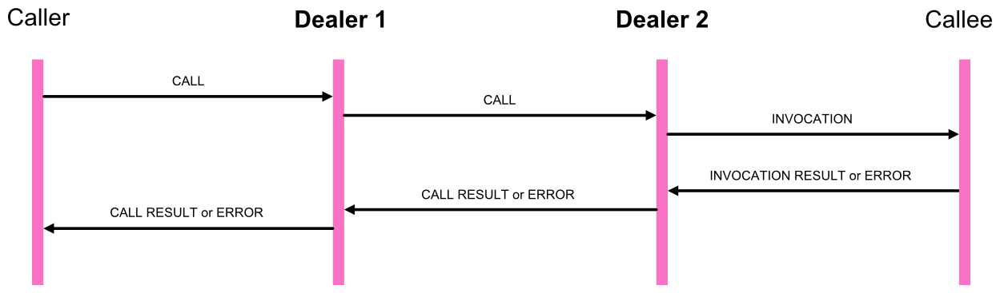
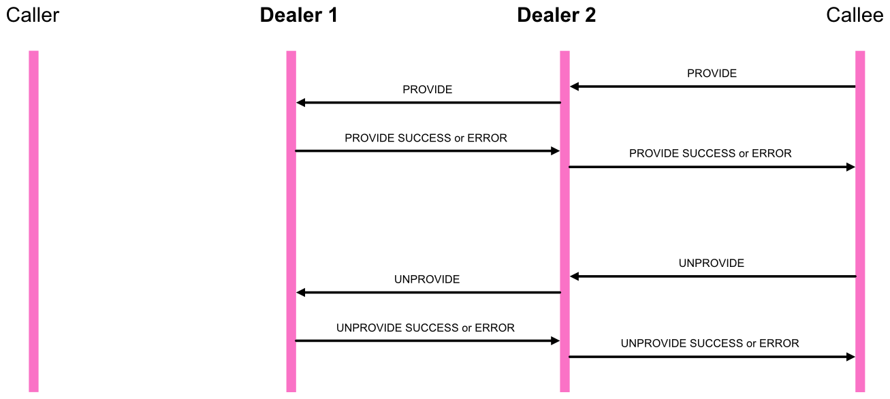
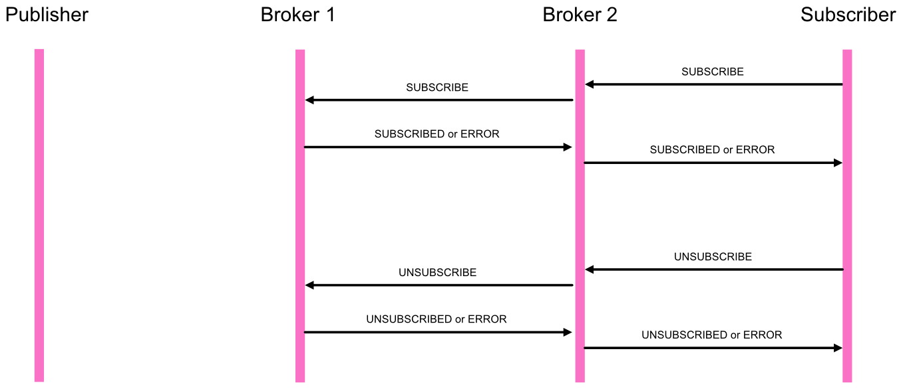
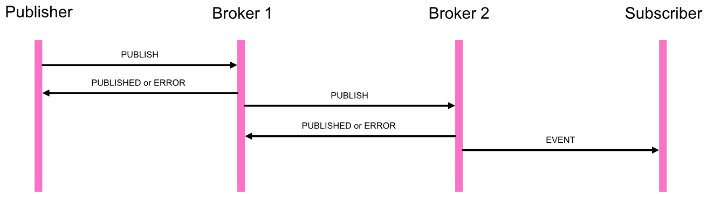

http://docs.oracle.com/javase/specs/jls/se5.0/html/packages.html#7.7
http://en.wikipedia.org/wiki/Java_package
http://docs.oracle.com/javase/tutorial/java/package/namingpkgs.html
-->