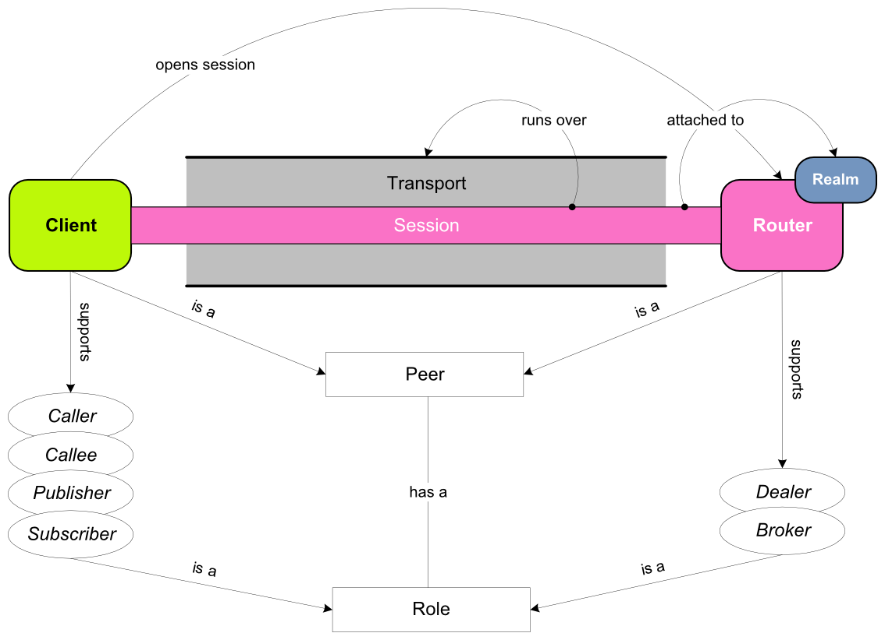
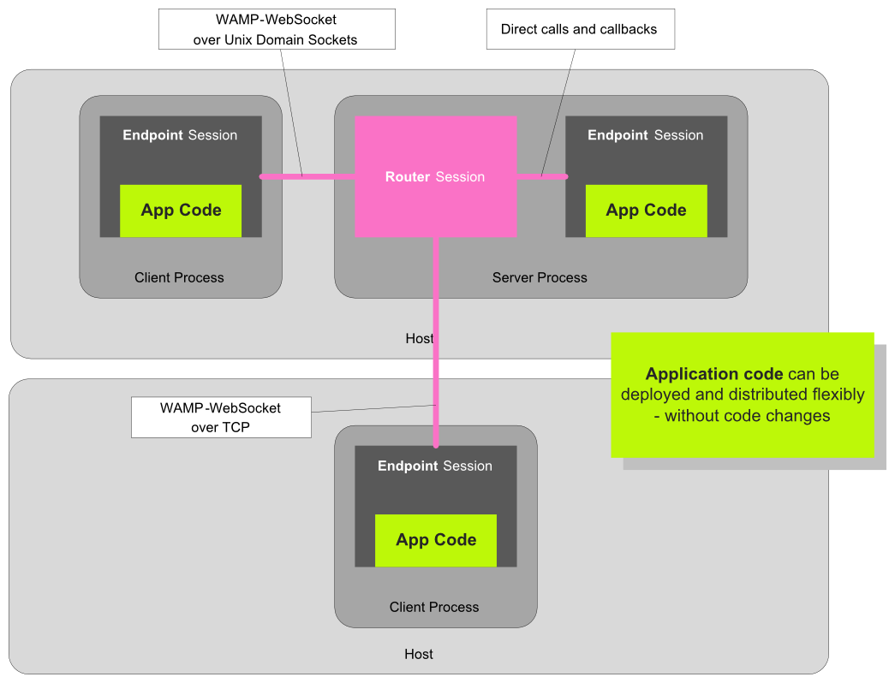
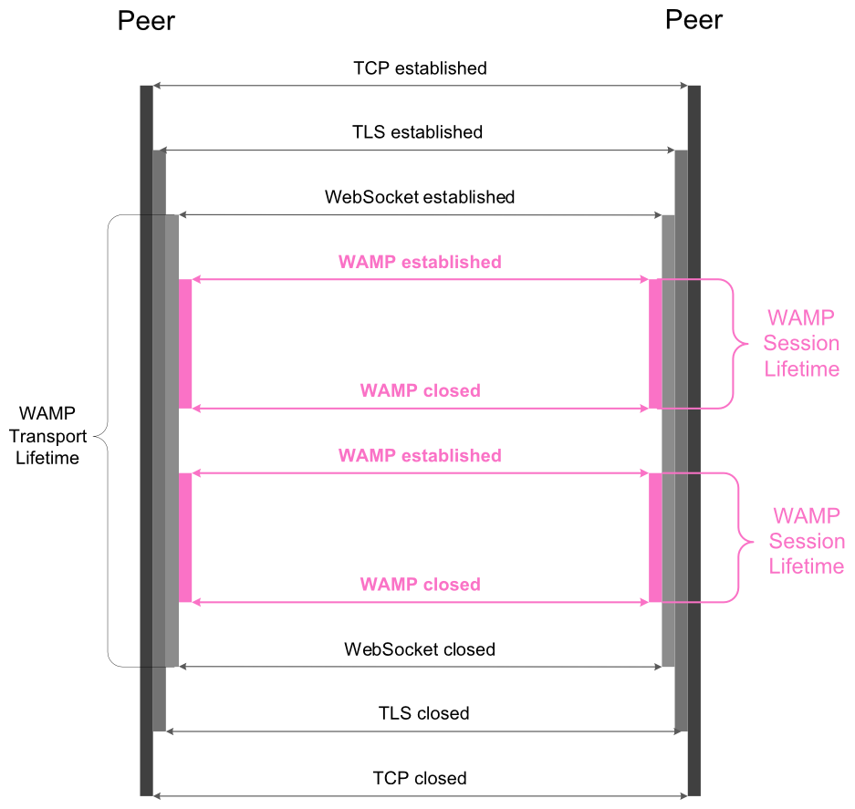
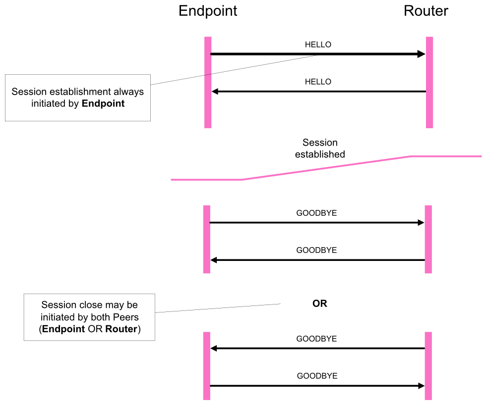
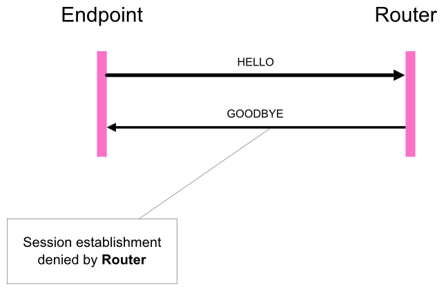

# The Web Application Messaging Protocol
# Part 1: Basic Profile

This document specifies the *basic profile* of the [Web Application Messaging Protocol (WAMP)](http://wamp.ws/).

Document Revision: **rc-1**, 2014/02/18

Copyright (c) 2014 [Tavendo GmbH](http://www.tavendo.com). Licensed under the [Creative Commons CC-BY-SA license](http://creativecommons.org/licenses/by-sa/3.0/). "WAMP", "Crossbar.io" and "Tavendo" are trademarks of Tavendo GmbH.


**Contents**

1. [Introduction](#introduction)
    * [Peers and Roles](#peers-and-roles)
    * [Application Code](#application-code)
    * [Building Blocks](#building-blocks)
2. [Identifiers](#identifiers)
    * [URIs](#uris)
    * [IDs](#ids)
3. [Serializations](#serializations)
    * [JSON](#json)
    * [MsgPack](#msgpack)
4. [Transports](#transports)
    * [WebSocket Transport](#websocket-transport)
    * [Other Transports](#other-transports)
5. [Mandatory Messages](#mandatory-messages)
    * [Message Definitions](#message-definitions)
    * [Message Codes and Direction](#message-codes-and-direction)
6. [Session Management](#session-management)
    * [Session Establishment](#session-establishment)
    * [Session Closing](#session-closing)
7. [Publish & Subscribe](#publish--subscribe)
    * [Subscribing and Unsubscribing](#subscribing-and-unsubscribing)
    * [Publishing and Events](#publishing-and-events)
8. [Remote Procedure Calls](#remote-procedure-calls)
    * [Registering and Unregistering](#registering-and-unregistering)
    * [Calling and Invocations](#calling-and-invocations)
9. [Ordering Guarantees](#ordering-guarantees)
    * [Publish & Subscribe Ordering](#publish--subscribe-ordering)
    * [Remote Procedure Call Ordering](#remote-procedure-call-ordering)
10. [Appendix](#appendix)
    * [Byte Array Conversion](#byte-array-conversion)
    * [References](#references)


## Preface

This is *part 1* of the WAMP specification. It introduces the concepts and terminology, and describes the *mandatory* features and aspects of the protocol and its usage which together constitute the **WAMP Basic Profile**.

The information in this part is considered self-contained and sufficient for implementors of WAMP basic profile compliant and interoperable implementations.

For *optional* features and aspects of the protocol that are part of the **WAMP Advanced Profile**, please see
 [The Web Application Messaging Protocol, Part 2: Advanced Profile](advanced.md)


## Introduction

WAMP ("The Web Application Messaging Protocol") is a communication protocol that enables distributed application archictectures, with application functionality spread across nodes and all application communication decoupled by messages routed via dedicated WAMP routers.

WAMP provides applications with **two asynchronous messaging patterns within one** protocol:

 * Publish & Subscribe
 * Remote Procedure Calls

*Remote Procedure Call (RPC)* is a messaging pattern involving peers of three roles: *Caller*, *Dealer* and *Callee*.
A *Callee* registers procedures with application code to call remotely from *Callers* under application defined, unique names ("Procedure URIs"). A *Dealer* provides the routing of calls and results between *Callers* and *Callees*.

*Publish & Subscribe (PubSub* is a messaging pattern involving peers of three roles: *Publisher*, *Broker* and *Subscriber*.
A *Subscriber* subscribes to topics under application defined, unique names ("Topic URIs") to receive events published by *Publishers* to such topics. A *Broker* provides the routing of events from *Publishers* to *Subscribers*.


### Transports, Peers and Sessions

WAMP can run over different *transports*.
For [WebSocket](http://tools.ietf.org/html/rfc6455), its default transport, WAMP is defined as a proper, officially [registered WebSocket subprotocol](http://www.iana.org/assignments/websocket/websocket.xml).
WAMP also supports different *serializations*, including JSON and MsgPack.

A *Transport* connects two WAMP *Peers* and provides a channel over which WAMP messages for a WAMP *Session* can flow in both directions.

<center>
<p style="width: 560px;">

</a>
</center>

 1. *Realm*: a WAMP routing and administrative domain (optionally) protected by authentication and authorization.
 2. *Peer*: transient participant in a WAMP based application
 3. *Session*: transient conversation between two *Peers*; attached to a *Realm* and runs over a *Transport*.
 4. *Transport*: networking channel that carries a *Session*.


### Peers and Roles

A WAMP *Session* connects two *Peers*, a *Client* and a *Router*. A WAMP *Peer* can have one *or more* roles.

**Remote Procedure Call Roles**

The Remote Procedure Call messaging pattern involves peers of three roles:

1. *Callee* (Endpoint)
2. *Caller* (Endpoint)
3. *Dealer* (Router)

A *Caller* issues calls to remote procedures by providing the procedure URI and any arguments for the call.
The *Callee* will execute the procedure using the supplied arguments to the call and return the result of the call to the *Caller*. The *Caller* and *Callee* will usually run application code, while the *Dealer* works as a generic router for remote procedure calls decoupling *Callers* and *Callees*.

*Callees* register procedures they provide with *Dealers*. *Callers* initiate procedure calls first to *Dealers*. *Dealers* route calls incoming from *Callers* to *Callees* implementing the procedure called, as well as call results back from *Callees* to *Callers*.

**Publish & Subscribe Roles**

The Publish & Subscribe messaging pattern involves peers of three roles:

1. *Subscriber* (Endpoint)
2. *Publisher* (Endpoint)
3. *Broker* (Router)

where

 * *Subscribers* subscribe to topics they are interested in with *Brokers*.
 * *Publishers* publish events to topics at *Brokers*.
 * *Brokers* route events incoming from *Publishers* to *Subscribers* interested in the topic published to.

**Supported Roles**

A *Client* can implement any combination of the *Roles*:

 * *Callee*
 * *Caller*
 * *Publisher*
 * *Subscriber*

and a *Router* can implement the *Roles*:

 * *Dealer*
 * *Broker*

This document describes WAMP client-router communication. Direct client-client communication is not supported. Router-to-router communication is subject to router implementation specific definition.


**Decoupling**

In WAMP, *Dealers* are responsible for call routing, decoupling *Callers* from *Callees*, whereas *Brokers* are responsible for event routing, decoupling *Publishers* from *Subscribers*.

**Peers with multiple Roles**

Peers might implement more than one role: e.g. a peer might act as *Caller*, *Publisher* and *Subscriber* at the same time. Another peer might act as both a *Broker* and a *Dealer*.

While a *Router* may only act as a *Broker* and a *Dealer*, the system process the *Router* runs in may additionally implement an *Endpoint* with e.g. a *Callee* role. Here the *Router* may establish a connection with the *Endpoint* via WAMP direct calls and callbacks, so that no message serialization is necessary.

**Symmetry**

It is important to note that though the establishment of a transport connection might have a inherent asymmetry (like a *client* establishing a TCP and WebSocket connection to a *server*), and clients establish sessions by joining realms on routers, WAMP itself is designed to be fully symmetric for application components. 

After the transport and a session has been established, any application component may act as *Caller*, *Callee*, *Publisher* and *Subscriber* at the same time. *Routers* provide the fabric on top of which WAMP runs a symmetric application messaging service.


### Application Code

WAMP is designed for application code to run inside *Endpoints*, i.e. peers of the roles:

1. *Callee* and *Caller*
2. *Publisher* and *Subscriber*

*Routers*, i.e. peers of the roles *Brokers* and *Dealers* are responsible for **generic call and event routing** and SHOULD NOT run application code.



> However, a *program* that implements the *Dealer* role might at the same time implement a built-in *Callee*. It is the *Dealer* and *Broker* that SHOULD be generic, not the program.
>

The idea is to be able to transparently switch *Broker* and *Dealer* implementations without affecting the application. Specific *Broker* and *Dealer* implementations however might differ regarding these features:

* clustering
* high-availability and scale-out
* message persistence
* authorization schemes
* management and monitoring


### Building Blocks

WAMP is defined with respect to the following building blocks

   1. Identifier
   2. Serialization
   3. Transport

For each building block, WAMP only assumes a defined set of requirements, which allows to run WAMP variants with different concrete bindings.


## Identifiers

### URIs

WAMP needs to identify the following *persistent* resources:

  1. Topics
  2. Procedures
  3. Errors

These are identified in WAMP using *Uniform Resource Identifiers* (URIs) that MUST BE UTF-8 encoded Unicode strings.

*Examples*

   com.myapp.mytopic1
   com.myapp.myprocedure1
   com.myapp.myerror1

The URIs are understood to form a single, global, hierarchical namespace for WAMP.

> The namespace is unified for topics, procedures and errors - these different resource types do NOT have separate namespaces.
>

To avoid resource naming conflicts, we follow the package naming convention from Java where URIs SHOULD begin with (reversed) domain names owned by the organization defining the URI.

URI components (the parts between between `.`) MUST NOT contain `.` and MUST NOT be empty (zero-length strings).

> We cannot allow `.` in component strings, since `.` is used to separate components, and WAMP associates semantics with resource hierarchies such as in pattern-based subscriptions. We cannot allow empty (zero-length) strings as components, since this has special meaning to denote wildcard components with pattern-based subscriptions. More about pattern-based subscriptions can be found in part 2 of this document.

URIs MUST NOT contain `#`, which is reserved for internal use by *Dealers* and *Brokers*.

URI components SHOULD match the regular expression `[a-z][a-z0-9_]*` (that is start with a letter, followed by zero or more letters, digits or `_`).

> Following the suggested regular expression will make URI components valid identifiers in most languages (modulo language keywords) and the use of lower-case only will make those identifiers unique in languages that have case-insensitive identifiers. Following this suggestion can allow implementations to map topics, procedures and errors to the language enviroment in a completely transparent way.

Further, application URIs MUST NOT use `wamp` as a first URI component, since this is reserved for URIs predefined with the WAMP protocol itself.

*Examples*

   wamp.error.not_authorized
   wamp.metatopic.subscriber.add

### IDs

WAMP needs to identify the following *ephemeral* entities:

 1. Sessions
 2. Subscriptions
 3. Publications
 4. Registrations
 5. Requests

These are identified in WAMP using IDs that are integers between (inclusive) `0` and `2^53` (`9007199254740992L`) and which MUST BE drawn *randomly* from a *uniform distribution* over the specified range.

> The reason to choose the specific upper bound is that `2^53` is the largest integer such that this integer and *all* (positive) smaller integers can be represented exactly in IEEE-754 doubles. Some languages (e.g. JavaScript) use doubles as their sole number type. Most languages do have signed and unsigned 64-bit integer types which both can hold any value from the specified range.
>


## Serializations

WAMP is a message based protocol that requires serialization of messages to octet sequences to be sent out on the wire.

A message *serialization* format is assumed that (at least) provides the following types:

  * `integer` (non-negative)
  * `string` (UTF-8 encoded Unicode)
  * `bool`
  * `list`
  * `dict` (with string keys)

> WAMP *itself* only uses theabove types, e.g. it does not use the JSON types `number` (non-integer) and `null`. The *application payloads* transmitted by WAMP (e.g. in call arguments or event payloads) may use other types a concrete serialization format supports.
>

WAMPv2 defines two bindings for message *serialization*:

 1. [JSON](http://www.json.org/)
 2. [MsgPack](http://msgpack.org/)

Other bindings for *serialization* may be defined in future WAMP versions.

### JSON

With JSON serialization, each WAMP message is serialized according to the JSON specification as described in [RFC4627](http://www.ietf.org/rfc/rfc4627.txt).

Further, binary data follows a convention for conversion to JSON strings. For details, see the Appendix.

### MsgPack

With MsgPack serialization, each WAMP message is serialized according to the MsgPack specification as described in [here](https://github.com/msgpack/msgpack/blob/master/spec.md).

The version 5 of MsgPack MUST BE used, since this version is able to differentiate between strings and binary values.


## Transports

WAMP assumes a *transport* with the following characteristics:

  1. message-based
  2. reliable
  3. ordered
  4. bidirectional (full-duplex)


### WebSocket Transport

The default transport binding for WAMPv2 is [WebSocket](http://tools.ietf.org/html/rfc6455).

As a default, each WAMP message is transmitted as a separate WebSocket message.




### Other Transports

Besides the WebSocket transport, the following WAMP transports are under development:

 * HTTP 1.0/1.1 long-polling

Here, the bi-directionality requirement for the transport is implemented by using long-polling for the server-side sending of messages.

Other transports such as HTTP 2.0 ("SPDY"), raw TCP or UDP might be defined in the future.


## Messages

All WAMP messages are of the same structure, a `list` with a first element `MessageType` followed by one or more message type specific elements:

    [MessageType|integer, ... one or more message type specific elements ...]

The notation `Element|type` denotes a message element named `Element` of type `type`, where `type` is one of:

 * `integer`: a non-negative integer
 * `string`: any UTF-8 encoded Unicode string, including the empty string
 * `bool`: a boolean value (`true` or `false`)
 * `id`: an integer ID as defined in [section IDs](#ids)
 * `uri`: a string URI as defined in [section URIs](#uris)
 * `dict`: a dictionary (map)
 * `list`: a list (array)

**Extensibility**
Some WAMP messages contain `Options|dict` or `Details|dict` elements. This allows for future extensibility and implementations that only provide subsets of functionality by ignoring unimplemented attributes. Keys in `Options` and `Details` MUST BE of type `string` and MUST match the regular expression `[a-z][a-z0-9_]{2,15}*` for WAMP predefined keys. Implementation MAY use implementation-specific key which MUST match the regular expression `_[a-z0-9_]{2,15}*`.

**Polymorphism**
For a given `MessageType` and number of message elements the expected types are uniquely defined. Hence there are no polymorphic messages in WAMP. This leads to a message parsing and validation control flow that is efficient, simple to implement and simple to code for rigorous message format checking.

**Structure**
The *application* payload (that is call arguments, call results, event payload etc) is always at the end of the message element list. The rationale is: *Brokers* and *Dealers* have no need to inspect (parse) the application payload. Their business is call/event routing. Having the application payload at the end of the list allows *Brokers* and *Dealers* to skip parsing it altogether. This improves efficiency/performance and probably even allows to transport encrypted application payloads transparently.

*Examples*

A `SUBSCRIBE` message:

	[32, 713845233, {}, "com.myapp.mytopic1"]


### Message Definitions

WAMP defines the following MANDATORY messages which are explained in detail in the following sections.

The messages concerning the WAMP session itself are mandatory for all peers, i.e. an *Endpoint* MUST implement `HELLO`, `ABORT` and `GOODBYE`, while a *Router* MUST implement `WELCOME`, `ABORT` and `GOODBYE

All other messages are mandatory *per role*, i.e. in an implementation which only provides an *Endpoint* with the role of *Publisher* MUST additionally implement sending `PUBLISH` and receiving `PUBLISHED` and `ERROR` messages.

#### `HELLO`

    [HELLO, Realm|uri, Details|dict]

#### `WELCOME`

    [WELCOME, Session|id, Details|dict]

#### `ABORT`

    [ABORT, Reason|uri, Details|dict]

#### `GOODBYE`

    [GOODBYE, Reason|uri, Details|dict]

#### `ERROR`

    [ERROR, REQUEST.Type|int, REQUEST.Request|id, Details|dict, Error|uri]
    [ERROR, REQUEST.Type|int, REQUEST.Request|id, Details|dict, Error|uri, Arguments|list]
    [ERROR, REQUEST.Type|int, REQUEST.Request|id, Details|dict, Error|uri, Arguments|list, ArgumentsKw|dict]

#### `PUBLISH`

    [PUBLISH, Request|id, Options|dict, Topic|uri]
    [PUBLISH, Request|id, Options|dict, Topic|uri, Arguments|list]
    [PUBLISH, Request|id, Options|dict, Topic|uri, Arguments|list, ArgumentsKw|dict]

#### `PUBLISHED`

    [PUBLISHED, PUBLISH.Request|id, Publication|id]

#### `SUBSCRIBE`

    [SUBSCRIBE, Request|id, Options|dict, Topic|uri]

#### `SUBSCRIBED`

    [SUBSCRIBED, SUBSCRIBE.Request|id, Subscription|id]

#### `UNSUBSCRIBE`

    [UNSUBSCRIBE, Request|id, SUBSCRIBED.Subscription|id]

#### `UNSUBSCRIBED`

    [UNSUBSCRIBED, UNSUBSCRIBE.Request|id]

#### `EVENT`

    [EVENT, SUBSCRIBED.Subscription|id, PUBLISHED.Publication|id, Details|dict]
    [EVENT, SUBSCRIBED.Subscription|id, PUBLISHED.Publication|id, Details|dict, PUBLISH.Arguments|list]
    [EVENT, SUBSCRIBED.Subscription|id, PUBLISHED.Publication|id, Details|dict, PUBLISH.Arguments|list,
      PUBLISH.ArgumentsKw|dict]

#### `CALL`

    [CALL, Request|id, Options|dict, Procedure|uri]
    [CALL, Request|id, Options|dict, Procedure|uri, Arguments|list]
    [CALL, Request|id, Options|dict, Procedure|uri, Arguments|list, ArgumentsKw|dict]

#### `RESULT`

    [RESULT, CALL.Request|id, Details|dict]
    [RESULT, CALL.Request|id, Details|dict, YIELD.Arguments|list]
    [RESULT, CALL.Request|id, Details|dict, YIELD.Arguments|list, YIELD.ArgumentsKw|dict]

#### `REGISTER`

    [REGISTER, Request|id, Options|dict, Procedure|uri]

#### `REGISTERED`

   [REGISTERED, REGISTER.Request|id, Registration|id]

#### `UNREGISTER`

    [UNREGISTER, Request|id, REGISTERED.Registration|id]

#### `UNREGISTERED`

    [UNREGISTERED, UNREGISTER.Request|id]

#### `INVOCATION`

    [INVOCATION, Request|id, REGISTERED.Registration|id, Details|dict]
    [INVOCATION, Request|id, REGISTERED.Registration|id, Details|dict, CALL.Arguments|list]
    [INVOCATION, Request|id, REGISTERED.Registration|id, Details|dict, CALL.Arguments|list, CALL.ArgumentsKw|dict]

#### `YIELD`

    [YIELD, INVOCATION.Request|id, Options|dict]
    [YIELD, INVOCATION.Request|id, Options|dict, Arguments|list]
    [YIELD, INVOCATION.Request|id, Options|dict, Arguments|list, ArgumentsKw|dict]


### Message Codes and Direction

The following table lists the message type code for **all 25 messages defined in WAMP v2** and their direction between peer roles.

In order to provide a single, authoritative overview of *all* WAMP messages, this table includes both the *mandatory* messages described here and the *optional* messages described in part 2 of this document.

"Tx" means the message is sent by the respective role, and "Rx" means the message is received by the respective role.

| Code | Message        |  Profile |  Publisher  |  Broker  |  Subscriber  |  Caller  |  Dealer  |  Callee  |
|------|----------------|----------|-------------|----------|--------------|----------|----------|----------|
|  1   | `HELLO`        |          | Tx          | Rx       | Tx           | Tx       | Rx       | Tx       |
|  2   | `WELCOME`      |          | Rx          | Tx       | Rx           | Rx       | Tx       | Rx       |
|  2   | `ABORT`        |          | Rx          | Tx       | Rx           | Rx       | Tx       | Rx       |
|  3   | `CHALLENGE`    | advanced | Rx          | Tx       | Rx           | Rx       | Tx       | Rx       |
|  4   | `AUTHENTICATE` | advanced | Tx          | Rx       | Tx           | Tx       | Rx       | Tx       |
|  5   | `GOODBYE`      |          | Tx/Rx       | Tx/Rx    | Tx/Rx        | Tx/Rx    | Tx/Rx    | Tx/Rx    |
|  6   | `HEARTBEAT`    | advanced | Tx/Rx       | Tx/Rx    | Tx/Rx        | Tx/Rx    | Tx/Rx    | Tx/Rx    |
|  7   | `ERROR`        |          | Rx          | Tx       | Rx           | Rx       | Tx/Rx    | Tx/Rx    |
|      |                |          |             |          |              |          |          |          |
| 16   | `PUBLISH`      |          | Tx          | Rx       |              |          |          |          |
| 17   | `PUBLISHED`    |          | Rx          | Tx       |              |          |          |          |
|      |                |          |             |          |              |          |          |          |
| 32   | `SUBSCRIBE`    |          |             | Rx       | Tx           |          |          |          |
| 33   | `SUBSCRIBED`   |          |             | Tx       | Rx           |          |          |          |
| 34   | `UNSUBSCRIBE`  |          |             | Rx       | Tx           |          |          |          |
| 35   | `UNSUBSCRIBED` |          |             | Tx       | Rx           |          |          |          |
| 36   | `EVENT`        |          |             | Tx       | Rx           |          |          |          |
|      |                |          |             |          |              |          |          |          |
| 48   | `CALL`         |          |             |          |              | Tx       | Rx       |          |
| 49   | `CANCEL`       | advanced |             |          |              | Tx       | Rx       |          |
| 50   | `RESULT`       |          |             |          |              | Rx       | Tx       |          |
|      |                |          |             |          |              |          |          |          |
| 64   | `REGISTER`     |          |             |          |              |          | Rx       | Tx       |
| 65   | `REGISTERED`   |          |             |          |              |          | Tx       | Rx       |
| 66   | `UNREGISTER`   |          |             |          |              |          | Rx       | Tx       |
| 67   | `UNREGISTERED` |          |             |          |              |          | Tx       | Rx       |
| 68   | `INVOCATION`   |          |             |          |              |          | Tx       | Rx       |
| 69   | `INTERRUPT`    | advanced |             |          |              |          | Tx       | Rx       |
| 70   | `YIELD`        |          |             |          |              |          | Rx       | Tx       |


## Session Management

The message flow between *Endpoints* and *Routers* for establishing and tearing down sessions involves the following messages:

1. `HELLO`
2. `WELCOME`
3. `ABORT`
4. `GOODBYE`

### Session Establishment

#### HELLO

After the underlying transport has been opened, a establishment of a WAMP session is initiated by the the *Endpoint* sending a `HELLO` message to the *Router*

    [HELLO, Realm|uri, Details|dict]

 * `Realm` is a string identifying the WAMP routing and administrative domain for which the session is to be established.
 * `Details` is a dictionary that allows to provide additional opening information (see below).

The `HELLO` message MUST be the very first message sent after the transport has been established.
In basic implementations without authentication it MUST be followed by a `WELCOME` or `ABORT` by the *Router*.



A WAMP session starts its lifetime when the *Router* has sent a `WELCOME` message to the *Endpoint*, and ends when the underlying transport closes or when the session is closed explicitly by either peer sending the `GOODBYE` message.

It is a protocol error to receive a second `HELLO` message during the lifetime of the session and the *Router* MUST fail the session if that happens.

**Roles and Features**

An *Endpoint* MUST annouce the roles it supports via `Hello.Details.roles|dict`, with a key mapping to a `Hello.Details.roles.<role>|dict` where `<role>` can be:

 * `publisher`
 * `subscriber`
 * `caller`
 * `callee`

An *Endpoint* can support any combination of above roles but MUST support at least one role.

The `<role>|dict` is a dictionary describing features supported by the peer for that role. In basic implementations, this will be empty.

*Example: An *Endpoint* that implements the roles of Publisher and Subscriber, and only supports basic features.*

	[1, 9129137332, {
      "roles": {
         "publisher": {},
         "subscriber": {}
      }
   	}]


#### WELCOME

A *Router* completes the establishment of a WAMP connection by sending a `WELCOME` message to the *Endpoint*.

   	[WELCOME, Session|id, Details|dict]

 * `Session` MUST be a randomly generated ID specific to the WAMP session. This applies for the lifetime of the session. The `WELCOME.Session` can be used for specifying lists of excluded or eligible receivers when publishing events (see below).
 * `Details` is a dictionary that allows to provide additional information regarding the established session (see below).

In basic implementations without authentication, a `WELCOME` MUST be sent directly in response to a `HELLO` message.

> Note. The behaviour if a requested `Realm` does not presently exist is router-specific. A router may e.g. create the realm, or deny the establishment of the session.
>

**Roles and Features**

A *Router* MUST annouce the roles it supports via `Hello.Details.roles|dict`, with a key mapping to a `Hello.Details.roles.<role>|dict` where `<role>` can be:

 * `broker`
 * `dealer`

A *Router* MUST support at least one role, and MAY support both roles.

The `<role>|dict` is a dictionary describing features supported by the peer for that role. In basic implementations, this is empty.

*Example: A Router implementing the role of Broker and supporting only basic features.*

   	[1, 9129137332, {
      "roles": {
         "broker": {}
      }
   	}]

*Feature Announcemenet*

The use of *feature announcement* in WAMP allows for

 * only implementing subsets of functionality
 * graceful degration

For a description of advanced features, see part 2 of this document.


#### ABORT

Both the *Router* and the *Endpoint* may abort the establishment of a WAMP session 



by sending an `ABORT` message.

   	[ABORT, Reason|uri, Details|dict]

 * `Reason` MUST be an URI.
 * `Details` is a dictionary that allows to provide additional, optional closing information (see below).

No response to a `ABORT` message is expected.

*Example*

    [2, "wamp.error.nonexistent_realm", {"message": "The realm does not exist."}]


### Session Closing

A WAMP session starts its lifetime with the *Router* sending a `WELCOME` message to the *Endpoint* and ends when the underlying transport closes or when the session is closed explicitly by a `GOODBYE` message sent by one peer and a `GOODBYE` message sent from the other peer in response.

   	[GOODBYE, Reason|uri, Details|dict]

 * `Reason` MUST be an URI.
 * `Details` is a dictionary that allows to provide additional, optional closing information (see below).

*Example*. One *Peer* initiates closing

    [2, "wamp.error.system_shutdown", {"message": "The host is shutting down now."}]

and the other peer replies

	[2, "wamp.error.goodbye_and_out"]


*Example*. One *Peer* initiates closing

    [2, "wamp.error.close_realm", {}]

and the other peer replies

	[2, "wamp.error.goodbye_and_out"]


*Example*. One *Peer* initiates closing

    [2, "wamp.error.protocol_violation", {"message": "Invalid type for 'topic' in SUBSCRIBE."}]

and the other peer replies

	[2, "wamp.error.goodbye_and_out"]


## Publish & Subscribe

All of the following features for Publish & Subscribe are mandatory for WAMP implementations supporting the respective roles.


### Subscribing and Unsubscribing

The message flow between *Enpoints* implementing the role of *Subscriber* and *Routers* implementing the role of *Broker* for subscribing and unsubscribing involves the following messages:

 1. `SUBSCRIBE`
 2. `SUBSCRIBED`
 3. `UNSUBSCRIBE`
 4. `UNSUBSCRIBED`
 5. `ERROR`


A *Subscriber* may subscribe to zero, one or more topics, and a *Publisher* publishes to topics without knowledge of subscribers.

Upon subscribing to a topic via the `SUBSCRIBE` message, a *Subscriber* will receive any future asynchronous events published to the respective topic by *Publishers*.

A subscription lasts for the duration of a session, unless a *Subscriber* opts out from a previously established subscription via the `UNSUBSCRIBE` message.


#### SUBSCRIBE

A *Subscriber* communicates its interest in a topic to a *Broker* by sending a `SUBSCRIBE` message:

    [SUBSCRIBE, Request|id, Options|dict, Topic|uri]

where

 * `Request` is a random, ephemeral ID chosen by the *Subscriber* and used to correlate the *Broker's* response with the request.
 * `Options` is a dictionary that allows to provide additional subscription request details in a extensible way. This is described further below.
 * `Topic` is the topic the *Subscriber* wants to subscribe to.

*Example*

	[32, 713845233, {}, "com.myapp.mytopic1"]


#### SUBSCRIBED

If the *Broker* is able to fulfill and allow the subscription, it answers by sending a `SUBSCRIBED` message to the *Subscriber*

    [SUBSCRIBED, SUBSCRIBE.Request|id, Subscription|id]

where

 * `SUBSCRIBE.Request` is the ID from the original request.
 * `Subscription` is an ID chosen by the *Broker* for the subscription.

*Example*

   	[33, 713845233, 5512315355]

> Note. The `Subscription` ID chosen by the broker need not be unique to the subscription of a single *Subscriber*, but may be assigned to the `Topic`, or the combination of the `Topic` and some or all `Options`, such as the topic pattern matching method to be used. Then this ID may be sent to all *Subscribers* for the this `Topic` or `Topic` /  `Options` combination. This allows the *Broker* to serialize an event to be delivered only once for all actual receivers of the event.
>

#### Subscription ERROR

When the request for subscription cannot be fulfilled by the *Broker*, the *Broker* sends back a `ERROR` message to the *Subscriber*

    [ERROR, SUBSCRIBE.Request|id, Details|dict, Error|uri]

where

 * `SUBSCRIBE.Request` is the ID from the original request.
 * `Error` is an URI that gives the error of why the request could not be fulfilled.

*Example*

   	[4, 713845233, {}, "wamp.error.not_authorized"]


#### UNSUBSCRIBE

When a *Subscriber* is no longer interested in receiving events for a subscription it sends an `UNSUBSCRIBE` message

    [UNSUBSCRIBE, Request|id, SUBSCRIBED.Subscription|id]

where

 * `Request` is a random, ephemeral ID chosen by the *Subscriber* and used to correlate the *Broker's* response with the request.
 * `SUBSCRIBED.Subscription` is the ID for the subscription to unsubcribe from, originally handed out by the *Broker* to the *Subscriber*.

*Example*

   	[34, 85346237, 5512315355]

#### UNSUBSCRIBED

Upon successful unsubscription, the *Broker* sends an `UNSUBSCRIBED` message to the *Subscriber*

    [UNSUBSCRIBED, UNSUBSCRIBE.Request|id]

where

 * `UNSUBSCRIBE.Request` is the ID from the original request.

*Example*

   	[35, 85346237]


#### Unsubscribe ERROR

When the request fails, the *Broker* sends an `ERROR`

    [ERROR, UNSUBSCRIBE.Request|id, Details|dict, Error|uri]

where

 * `UNSUBSCRIBE.Request` is the ID from the original request.
 * `Error` is an URI that gives the error of why the request could not be fulfilled.

*Example*

   	[4, 85346237, {}, "wamp.error.no_such_subscription"]


### Publishing and Events

The message flow between *Publishers*, a *Broker* and *Subscribers* for publishing to topics and dispatching events involves the following messages:

 1. `PUBLISH`
 2. `PUBLISHED`
 3. `EVENT`
 4. `ERROR`


#### PUBLISH

When a *Publisher* wishes to publish an event to some topic, it sends a `PUBLISH` message to a *Broker*:

    [PUBLISH, Request|id, Options|dict, Topic|uri]

or

   	[PUBLISH, Request|id, Options|dict, Topic|uri, Arguments|list]

or

   	[PUBLISH, Request|id, Options|dict, Topic|uri, Arguments|list, ArgumentsKw|dict]

where

 * `Request` is a random, ephemeral ID chosen by the *Publisher* and used to correlate the *Broker's* response with the request.
 * `Options` is a dictionary that allows to provide additional publication request details in an extensible way. This is described further below.
 * `Topic` is the topic published to.
 * `Arguments` is list of application-level event payload elements. The list may be of zero length.
 * `ArgumentsKw` is a dictionary containing application-level event payload, provided as keyword arguments. The dictionary may be empty.

*Example*

    [16, 239714735, {}, "com.myapp.mytopic1"]

*Example*

    [16, 239714735, {}, "com.myapp.mytopic1", ["Hello, world!"]]

*Example*

    [16, 239714735, {}, "com.myapp.mytopic1", [], {"color": "orange", "sizes": [23, 42, 7]}]


#### PUBLISHED

If the *Broker* is able to fulfill and allowing the publication, it answers by sending a `PUBLISHED` message to the *Publisher*:

    [PUBLISHED, PUBLISH.Request|id, Publication|id]

where

 * `PUBLISH.Request` is the ID from the original publication request.
 * `Publication` is a ID chosen by the Broker for the publication.

*Example*

    [17, 239714735, 4429313566]

#### Publish ERROR

When the request for publication cannot be fulfilled by the *Broker*, the *Broker* sends back an `ERROR` message to the *Publisher*

    [ERROR, PUBLISH.Request|id, Details|dict, Error|uri]

where

 * `PUBLISH.Request` is the ID from the original publication request.
 * `Error` is an URI that gives the error of why the request could not be fulfilled.

*Example*

    [4, 239714735, {}, "wamp.error.not_authorized"]

*Example*

    [4, 239714735, {}, "wamp.error.invalid_topic"]

#### EVENT

When a publication is successful and a *Broker* dispatches the event, it determines a list of receivers for the event based on subscribers for the topic published to and, possibly, other information in the event (such as exclude and eligible receivers).

When a *Subscriber* is deemed to be a receiver, the *Broker* sends the *Subscriber* an `EVENT` message:

    [EVENT, SUBSCRIBED.Subscription|id, PUBLISHED.Publication|id, Details|dict]

or

    [EVENT, SUBSCRIBED.Subscription|id, PUBLISHED.Publication|id, Details|dict,
      PUBLISH.Arguments|list]

or

    [EVENT, SUBSCRIBED.Subscription|id, PUBLISHED.Publication|id, Details|dict,
      PUBLISH.Arguments|list, PUBLISH.ArgumentKw|dict]

where

 * `SUBSCRIBED.Subscription` is the ID for the subscription under which the *Subscriber* receives the event - the ID for the subscription originally handed out by the *Broker* to the *Subscriber*.
 * `PUBLISHED.Publication` is the ID of the publication of the published event.
 * `Details` is a dictionary that allows the *Broker* to provide additional event details in a extensible way. This is described further below.
 * `PUBLISH.Arguments` is the application-level event payload that was provided with the original publication request.
 * `PUBLISH.ArgumentKw` is the application-level event payload that was provided with the original publication request.

*Example*

   	[36, 5512315355, 4429313566, {}]

*Example*

   	[36, 5512315355, 4429313566, {}, ["Hello, world!"]]

*Example*

   	[36, 5512315355, 4429313566, {}, [], {"color": "orange", "sizes": [23, 42, 7]}]


## Remote Procedure Calls

All of the following features for Remote Procedure Calls are mandatory for WAMP implementations supporting the respective roles.


### Registering and Unregistering

The message flow between *Callees* and a *Dealer* for registering and unregistering endpoints to be called over RPC involves the following messages:

 1. `REGISTER`
 2. `REGISTERED`
 4. `UNREGISTER`
 5. `UNREGISTERED`
 6. `ERROR`


#### REGISTER

A *Callee* announces the availability of an endpoint implementing a procedure with a *Dealer* by sending a `REGISTER` message:

    [REGISTER, Request|id, Options|dict, Procedure|uri]

where

 * `Request` is a random, ephemeral ID chosen by the *Callee* and used to correlate the *Dealer's* response with the request.
 * `Options` is a dictionary that allows to provide additional registration request details in a extensible way. This is described further below.
 * `Procedure`is the procedure the *Callee* wants to register

*Example*

   	[64, 25349185, {}, "com.myapp.myprocedure1"]

#### REGISTERED

If the *Dealer* is able to fulfill and allowing the registration, it answers by sending a `REGISTERED` message to the `Callee`:

   	[REGISTERED, REGISTER.Request|id, Registration|id]

where

 * `REGISTER.Request` is the ID from the original request.
 *  `Registration` is an ID chosen by the *Dealer* for the registration.

*Example*

   	[65, 25349185, 2103333224]

#### Register ERROR

When the request for registration cannot be fullfilled by the *Dealer*, the *Dealer* sends back an `ERROR` message to the *Callee*:

    [ERROR, REGISTER.Request|id, Details|dict, Error|uri]

 * `REGISTER.Request` is the ID from the original request.
 * `Error` is an URI that gives the error of why the request could not be fulfilled.

*Example*

   	[4, 25349185, {}, "wamp.error.procedure_already_exists"]

#### UNREGISTER

When a *Callee* is no longer willing to provide an implementation of the registered procedure, it sends an `UNREGISTER` message to the *Dealer*:

    [UNREGISTER, Request|id, REGISTERED.Registration|id]

where

 * `Request` is a random, ephemeral ID chosen by the *Callee* and used to correlate the *Dealer's* response with the request.
 * `REGISTERED.Registration` is the ID for the registration to revoke, originally handed out by the *Dealer* to the *Callee*.

*Example*

   	[66, 788923562, 2103333224]

#### UNREGISTERED

Upon successful unregistration, the *Dealer* sends an `UNREGISTERED` message to the *Callee*:

    [UNREGISTERED, UNREGISTER.Request|id]

where

 * `UNREGISTER.Request` is the ID from the original request.

*Example*

	[67, 788923562]

#### Unregister ERROR

When the unregistration request fails, the *Dealer* sends an `ERROR` message:

    [ERROR, UNREGISTER.Request|id, Details|dict, Error|uri]

where

 * `UNREGISTER.Request` is the ID from the original request.
 * `Error` is an URI that gives the error of why the request could not be fulfilled.

*Example*

   	[4, 788923562, {}, "wamp.error.no_such_registration"]


### Calling and Invocations

The message flow between *Callers*, a *Dealer* and *Callees* for calling procedures and invoking endpoints involves the following messages:

 1. `CALL`
 2. `RESULT`
 3. `INVOCATION`
 4. `YIELD`
 5. `ERROR`


The execution of remote procedure calls is asynchronous, and there may be more than one call outstanding. A call is called outstanding (from the point of view of the *Caller*), when a (final) result or error has not yet been received by the *Caller*.

### CALL

When a *Callee* wishes to call a remote procedure, it sends a `CALL` message to a *Dealer*:

    [CALL, Request|id, Options|dict, Procedure|uri]

or

    [CALL, Request|id, Options|dict, Procedure|uri, Arguments|list]

or

    [CALL, Request|id, Options|dict, Procedure|uri, Arguments|list, ArgumentsKw|dict]

where

 * `Request` is a random, ephemeral ID chosen by the *Callee* and used to correlate the *Dealer's* response with the request.
 * `Options` is a dictionary that allows to provide additional call request details in an extensible way. This is described further below.
 * `Procedure` is the URI of the procedure to be called.
 * `Arguments` is a list of positional call arguments (each of arbitrary type). The list may be of zero length.
 * `ArgumentsKw` is a dictionary of keyword call arguments (each of arbitrary type). The dictionary may be empty.

*Example*

   	[48, 7814135, {}, "com.myapp.ping"]

*Example*

   	[48, 7814135, {}, "com.myapp.echo", ["Hello, world!"]]

*Example*

   	[48, 7814135, {}, "com.myapp.add2", [23, 7]]

*Example*

   	[48, 7814135, {}, "com.myapp.user.new", ["johnny"], {"firstname": "John", "surname": "Doe"}]

#### INVOCATION

If the *Dealer* is able to fullfill (mediate) the call and it allows the call, it sends a `INVOCATION` message to the respective *Callee* implementing the procedure:

    [INVOCATION, Request|id, REGISTERED.Registration|id, Details|dict]

or

    [INVOCATION, Request|id, REGISTERED.Registration|id, Details|dict, CALL.Arguments|list]

or

    [INVOCATION, Request|id, REGISTERED.Registration|id, Details|dict, CALL.Arguments|list, CALL.ArgumentsKw|dict]

where

 * `Request` is a random, ephemeral ID chosen by the *Dealer* and used to correlate the *Callee's* response with the request.
 * `REGISTERED.Registration` is the registration ID under which the procedure was registered at the *Dealer*.
 * `Details` is a dictionary that allows to provide additional invocation request details in an extensible way. This is described further below.
 * `CALL.Arguments` is the original list of positional call arguments as provided by the *Caller*.
 * `CALL.ArgumentsKw` is the original dictionary of keyword call arguments as provided by the *Caller*.

*Example*

   	[68, 6131533, 9823526, {}, ["Hello, world!"]]

#### YIELD

If the *Callee* is able to successfully process and finish the execution of the call, it answers by sending a `YIELD` message to the *Dealer*:

    [YIELD, INVOCATION.Request|id, Options|dict]

or

    [YIELD, INVOCATION.Request|id, Options|dict, Arguments|list]

or

    [YIELD, INVOCATION.Request|id, Options|dict, Arguments|list, ArgumentsKw|dict]

where

 * `INVOCATION.Request` is the ID from the original invocation request.
 * `Options`is a dictionary that allows to provide additional options.
 * `Arguments` is a list of positional result elements (each of arbitrary type). The list may be of zero length.
 * `ArgumentsKw` is a dictionary of keyword result elements (each of arbitrary type). The dictionary may be empty.

#### RESULT

The *Dealer* will then send a `RESULT` message to the original *Caller*:

    [RESULT, CALL.Request|id, Details|dict]

or

    [RESULT, CALL.Request|id, Details|dict, YIELD.Arguments|list]

or

    [RESULT, CALL.Request|id, Details|dict, YIELD.Arguments|list, YIELD.ArgumentsKw|dict]

where

 * `CALL.Request` is the ID from the original call request.
 * `Details` is a dictionary of additional details. --- EXAMPLES ???? ----
 * `YIELD.Arguments` is the original list of positional result elements as returned by the *Callee*.
 * `YIELD.ArgumentsKw` is the original dictionary of keyword result elements as returned by the *Callee*.

#### Invocation ERROR


If the *Callee* is unable to process or finish the execution of the call, or the application code implementing the procedure raises an exception or otherwise runs into an error, the *Callee* sends an `ERROR` message to the *Dealer*:

   	[ERROR, INVOCATION.Request|id, Details|dict, Error|uri]

or

   	[ERROR, INVOCATION.Request|id, Details|dict, Error|uri, Arguments|list]

or

   	[ERROR, INVOCATION.Request|id, Details|dict, Error|uri, Arguments|list, ArgumentsKw|dict]

where

 * `INVOCATION.Request` is the ID from the original call request.
 * `Details` is a dictionary containing detailed information about the error. ---- EXAMPLES ----
 * `Error` is an URI that gives the error of why the request could not be fulfilled.
 * `Exception` is an arbitrary application-defined error payload (possible empty, that is `null`).

--- EXAMPLES missing ----

#### Call ERROR

The *Dealer* will then send a `ERROR` message to the original *Caller*:

   	[ERROR, CALL.Request|id, Details|dict, Error|uri]

or

   	[ERROR, CALL.Request|id, Details|dict, Error|uri, Arguments|list]

or

   	[ERROR, CALL.Request|id, Details|dict, Error|uri, Arguments|list, ArgumentsKw|dict]

where

 * `CALL.Request` is the ID from the original call request.
 * `Details` is a dictionary with additional error details. ---- EXAMPLES ???? ----
 * `Error` is an URI identifying the type of error as returned by the *Callee* to the *Dealer*.
 * `Arguments` is a list containing the original error payload list as returned by the *Callee* to the *Dealer*.
 * `ArgumentsKw` is a dictionary containing the original error payload dictionary as returned by the *Callee* to the *Dealer*

---- Examples missing ----

If the original call already failed at the *Dealer* **before** the call would have been forwarded to any *Callee*, the *Dealer* also (and immediately) sends a `ERROR` message to the *Caller*:

   	[ERROR, CALL.Request|id, Details|dict, Error|uri]

*Example*

   	[4, 7814135, {}, "wamp.error.no_such_procedure"]


## Appendix

### Ordering Guarantees

#### Publish & Subscribe Ordering

Regarding **Publish & Subscribe**, the ordering guarantees are as follows:

If *Subscriber A* is subscribed to both **Topic 1** and **Topic 2**, and *Publisher B* first publishes an **Event 1** to **Topic 1** and then an **Event 2** to **Topic 2**, then *Subscriber A* will first receive **Event 1** and then **Event 2**. This also holds if **Topic 1** and **Topic 2** are identical.

In other words, WAMP guarantees ordering of events between any given *pair* of *Publisher* and *Subscriber*.

Further, if *Subscriber A* subscribes to **Topic 1**, the `SUBSCRIBED` message will be sent by *Broker* to *Subscriber A* before any `EVENT` message for **Topic 1**.

In general, `SUBSCRIBE` is asynchronous, and there is no guarantee on order of return for multiple `SUBSCRIBEs`. The first `SUBSCRIBE` might require the *Broker* to do a time-consuming lookup in some database, whereas the second might be permissible immediately.


#### Remote Procedure Call Ordering

Regarding **Remote Procedure Calls**, the ordering guarantees are as follows:

If *Callee A* has registered endpoints for both **Procedure 1** and **Procedure 2**, and *Caller B* first issues a **Call 1** to **Procedure 1** and then a **Call 2** to **Procedure 2**, and both calls are routed to *Callee A*, then *Callee A* will first receive an invocation corresponding to **Call 1** and then **Call 2**. This also holds if **Procedure 1** and **Procedure 2** are identical.

In other words, WAMP guarantees ordering of invocations between any given *pair* of *Caller* and *Callee*.

In general, there are no guarantees on the order of call results and errors in relation to calls, since the execution of calls upon invocation of endpoints in *Callees* is asynchronous. A first call might require an expensive, long-running computation, whereas a second, subsequent call might finish immediately.

Further, if *Callee A* registers for **Procedure 1**, the `REGISTERED` message will be sent by *Dealer* to *Callee A* before any `INVOCATION` message for **Procedure 1**.

In general, `REGISTER` is asynchronous, and there is no guarantee on order of return for multiple `REGISTERs`. The first `REGISTER` might require the *Dealer* to do a time-consuming lookup in some database, whereas the second might be permissible immediately.


### Binary conversion of JSON Strings

Binary data follows a convention for conversion to JSON strings.

A **byte array** is converted to a **JSON string** as follows:

1. convert the byte array to a Base64 encoded (host language) string
2. prepend the string with a `\0` character
3. serialize the string to a JSON string

*Example*

Consider the byte array (hex representation):

   	10e3ff9053075c526f5fc06d4fe37cdb

This will get converted to Base64

   	EOP/kFMHXFJvX8BtT+N82w==

prepended with `\0`

   	\x00EOP/kFMHXFJvX8BtT+N82w==

and serialized to a JSON string

   	"\\u0000EOP/kFMHXFJvX8BtT+N82w=="

A **JSON string** is deserialized to either a **string** or a **byte array** using the following procedure:

1. Unserialize a JSON string to a host language (Unicode) string
2. If the string starts with a `\0` character, interpret the rest (after the first character) as Base64 and decode to a byte array
3. Otherwise, return the Unicode string

Below are complete Python and JavaScript code examples for conversion between byte arrays and JSON strings.

#### Python

Here is a complete example in **Python** showing how byte arrays are converted to and from JSON:

```python
import os, base64, json, sys, binascii
PY3 = sys.version_info >= (3,)
if PY3:
   unicode = str

data_in = os.urandom(16)
print("In:   {}".format(binascii.hexlify(data_in)))

## encoding
encoded = json.dumps('\0' + base64.b64encode(data_in).decode('ascii'))

print("JSON: {}".format(encoded))

## decoding
decoded = json.loads(encoded)
if type(decoded) == unicode:
   if decoded[0] == '\0':
      data_out = base64.b64decode(decoded[1:])
   else:
      data_out = decoded

print("Out:  {}".format(binascii.hexlify(data_out)))

assert(data_out == data_in)
```

#### JavaScript

Here is a complete example in **JavaScript** showing how byte arrays are converted to and from JSON:

```javascript
var data_in = new Uint8Array(new ArrayBuffer(16));

// initialize test data
for (var i = 0; i < data_in.length; ++i) {
   data_in[i] = i;
}
console.log(data_in);

// convert byte array to raw string
var raw_out = '';
for (var i = 0; i < data_in.length; ++i) {
   raw_out += String.fromCharCode(data_in[i]);
}

// base64 encode raw string, prepend with \0 and serialize to JSON
var encoded = JSON.stringify("\0" + window.btoa(raw_out));
console.log(encoded); // "\u0000AAECAwQFBgcICQoLDA0ODw=="

// unserialize from JSON
var decoded = JSON.parse(encoded);

var data_out;
if (decoded.charCodeAt(0) === 0) {
   // strip first character and decode base64 to raw string
   var raw = window.atob(decoded.substring(1));

   // convert raw string to byte array
   var data_out = new Uint8Array(new ArrayBuffer(raw.length));
   for (var i = 0; i < raw.length; ++i) {
      data_out[i] = raw.charCodeAt(i);
   }
} else {
   data_out = decoded;
}

console.log(data_out);
```


### References

1. [Uniform Resource Identifier (URI): Generic Syntax, RFC 3986](http://tools.ietf.org/html/rfc3986)
2. [UTF-8, a transformation format of ISO 10646](http://tools.ietf.org/html/rfc3629)
3. [The WebSocket Protocol](http://tools.ietf.org/html/rfc6455)
4. [The application/json Media Type for JavaScript Object Notation (JSON)](http://tools.ietf.org/html/rfc4627)
5. [MessagePack Format specification](https://github.com/msgpack/msgpack/blob/master/spec.md)
6. [Consistent Hashing and Random Trees: Distributed Caching Protocols for Relieving Hot Spots on the World Wide Web (1997)](http://citeseerx.ist.psu.edu/viewdoc/summary?doi=10.1.1.23.3738)
7. [Web Caching with Consistent Hashing](http://www8.org/w8-papers/2a-webserver/caching/paper2.html)
